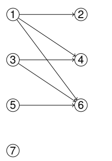

# CSE107 Discrete Mathematics and Statistics
<!-- TOC -->

- [1. Number Systems and Proof Techniques](#1-number-systems-and-proof-techniques)
  - [1.1. Types of Numbers](#11-types-of-numbers)
  - [1.2. Proof Techniques](#12-proof-techniques)
    - [1.2.1. Proof by contradiction](#121-proof-by-contradiction)
    - [1.2.2. Proof by induction](#122-proof-by-induction)
  - [1.3. Tutorial 1](#13-tutorial-1)
- [2. Set Theory](#2-set-theory)
  - [2.1. Notation](#21-notation)
  - [2.2. Important Sets](#22-important-sets)
  - [2.3. Subset](#23-subset)
  - [2.4. Equality](#24-equality)
  - [2.5. Operations on sets](#25-operations-on-sets)
  - [2.6. Algebra of sets](#26-algebra-of-sets)
  - [2.7. Power set](#27-power-set)
    - [2.7.1. Some laws](#271-some-laws)
  - [2.8. Cardinality of sets](#28-cardinality-of-sets)
    - [2.8.1. Computing the cardinality of sets](#281-computing-the-cardinality-of-sets)
  - [2.9. Ordered pairs](#29-ordered-pairs)
    - [2.9.1. Catesian plane](#291-catesian-plane)
  - [2.10. Bit strings of lengs n](#210-bit-strings-of-lengs-n)
  - [2.11. Tutorial 2](#211-tutorial-2)
- [3. Relations](#3-relations)
  - [3.1. Definition (Binary relation 二元关系)](#31-definition-binary-relation-二元关系)
  - [3.2. Representation](#32-representation)
  - [3.3. Unary relation 单元关系](#33-unary-relation-单元关系)
  - [3.4. Infix noatation for binary relation](#34-infix-noatation-for-binary-relation)
  - [3.5. Properties of binary relations](#35-properties-of-binary-relations)
  - [3.6. Transitive closure 传递闭包](#36-transitive-closure-传递闭包)
  - [3.7. Equivalence Relations](#37-equivalence-relations)
  - [3.8. Partition of a set](#38-partition-of-a-set)
  - [3.9. Partial orders](#39-partial-orders)
    - [3.9.1. Predecessors (我也不知道翻译是啥)(好了我知道了，是前元，感谢Ramos)](#391-predecessors-我也不知道翻译是啥好了我知道了是前元感谢ramos)
  - [3.10. Hasse diagram](#310-hasse-diagram)
  - [3.11. Total Order](#311-total-order)
  - [Tutorial](#tutorial)

<!-- /TOC -->
## 1. Number Systems and Proof Techniques

### 1.1. Types of Numbers

|Name|Property|
---|---|
Natural Numbers|**Closed under addition**
Integer|
Relational Numbers|Can be expressed as $\frac{x}{y}$ where $x,y\in Q$ and $y \ne 0$
Real Numbers|
Prime Numbers  *质数*| You all know that.

### 1.2. Proof Techniques

#### 1.2.1. Proof by contradiction

Example: Use proof by contracdition to prove $\sqrt{2}$ is a irrational number:

* If $\sqrt{2}$ were rational, then it can be written as $\sqrt{2}= \frac{x}{y}$ where $x,y\in Q$ and $x,y \ne 0$
* By repeatedly cancelling common factors, we can make sure that $x,y$ have no common factors so they are not both even.
* Since $2=\frac{x^2}{y^2}$, so $x^2$ is even, then $x$ is even.
* Let $x = 2w$, $w \in N$.
* Then $x^2 =4w^2$ so$4w^2 =2y^2$, $y^2 =2w^2$ so $y^2$ is even then so is $y$.
* This contradicts the fact that x and y are not both even, so 2 being rational, must have been wrong.

#### 1.2.2. Proof by induction

Normal steps:

1. Prove the first number holds the property.
2. Prove that if $n = m$ holds the property, then so is $n=m+1$.

Examples:

* For every natural number $n$, $2^{n+2} + 3^{2n+1}$ is divisible by $7$

### 1.3. Tutorial 1

- Use counter-example for easy question.
- When it comes to rational numbers, use the form $\frac{x}{y}$ to represent it.
- To prove $\sqrt n$ is not rational, usually the parity on the sides of the equation is different.

## 2. Set Theory

### 2.1. Notation

 $B = \lbrace 1,3,5\rbrace$  $\Rightarrow$ $1 \in B, 2 \notin B$
 
 For inexplicit set:  $S = \lbrace x | P(x)\rbrace$  e.g.
- $S = \lbrace x|x$ is an odd positive integer$\rbrace$
- $C = \lbrace n^2|n$ is an integer$\rbrace$

### 2.2. Important Sets
|Name|Notation|Field|
---|---|---|
Natural Numbers| $N$ | $\lbrace0,1,2…\rbrace$
Integers |$Z$|  $\lbrace …-1,0,1…\rbrace$
Positive Integers| $Z^+$| $\lbrace1,2,3…\rbrace$
Rationals| $Q$|$\lbrace\frac{x}{y}|x,y\in Z , y \ne 0\rbrace$
Real numbers| $R$ | $Z + Q$

### 2.3. Subset

- If **every** element of B is an element of A, then B is the subset of A. Notation: $B\subseteq A$.

### 2.4. *Equality*

If $B\subseteq A$ and $A\subseteq B$, then $A=B$.

### 2.5. Operations on sets

First of all, the sets to be operated must have **the same data type**.

|Name|Notation|Definition
---|---|--
Union| $A\bigcup B$| $\lbrace x\mid x\in A \bigvee x \in B\rbrace$
Intersection| $A\bigcap B$ | $\lbrace x\mid x\in A \bigwedge x \in B\rbrace$
Relative complement|$A-B$ |$\lbrace x\mid x\in A \bigwedge x \notin B\rbrace$  
Complement|$\sim A$|$\lbrace x\notin A\rbrace$
**Symmetric difference**|$A\triangle B$|$\lbrace x\mid(x\in A \bigwedge x\notin B)\bigvee(x\notin A \bigwedge x\in B)\rbrace$

### 2.6. Algebra of sets

 Suppose $A,B,C \subseteq U$ in all the situations below.

|Name|Content|
---|---
Commutative laws|$A\bigcup B=B\bigcup A,A\bigcap B = B \bigcap A$
Associative laws 结合律|$A\bigcup(B\bigcup C)= (A\bigcup B)\bigcup C, A\bigcap(B\bigcap C)= (A\bigcap B)\bigcap C$
*Identity laws*|$A\bigcup \emptyset=A,A\bigcup U = U, A\bigcap U = A, A\bigcap \emptyset= \emptyset$
**Distributive laws**分配律|$A\bigcap (B \bigcup C)= (A\bigcap B)\bigcup(A\bigcap C), A\bigcup(B\bigcap C)=(A\bigcup B)\bigcap(A\bigcap C)$
*Complement laws*|$A\bigcup \sim A=U, \sim U = \emptyset, \sim(\sim A)= A, A\bigcap \sim A=\emptyset,\sim \emptyset = U$
**De Morgan's laws**|$\sim (A \bigcup B)= \sim A\bigcap \sim B,\sim (A \bigcap B)= \sim A\bigcup \sim B$

### 2.7. Power set

The power set *Pow*(A) is the set of all the subsets of A, denoted by $Pow(A)=\lbrace C|C\subseteq A\rbrace$.

#### 2.7.1. Some laws

- $\forall A,B, Pow(A\bigcap B)= Pow(A) \bigcap Pow(B)$
  
- s$\exists A,B, Pow(A\bigcup B)\ne Pow(A) \bigcup Pow(B)$

### 2.8. Cardinality of sets

  For a **finite** set S, the cardinality equals the number of the elements in S, denoted by $|S|$.

#### 2.8.1. Computing the cardinality of sets

  If A, B, C are sets then:

> $|A\bigcup B|= |A|+|B|-|A\bigcap B|$
>
> $|A\bigcup B\bigcup C|=|A|+|B|+|C|-|A\bigcap B|-|A\bigcap C|-|B\bigcap C|+|A\bigcap B+\bigcap C|$

  Those above are special cases of **the principle of inclusion and exclusion**.

### 2.9. Ordered pairs

Introduced **cartesian product** $A\times B$, the set of consisting all pairs (a,b) with $a\in A \bigwedge b \in B$.

#### 2.9.1. *Catesian plane*

Use a cartesian coordinate system to represent pairs of numbers.

### 2.10. Bit strings of lengs n

Used to represent the **characteristic vector** of subsets of a set.

e.g. $S=\lbrace1,2,3,4,5\rbrace,A=\lbrace 1,3,5\rbrace, B=\lbrace3,4\rbrace$

- the CV(characteristic vector) of A is {1,0,1,0,1}
- the CV of B is {0,0,1,1,0}

### 2.11. Tutorial 2

- The catesian product holds the **distrubutive laws** as well.

## 3. Relations

### 3.1. Definition (Binary relation 二元关系)

### 3.2. Representation

|Type|Example|
---|---
Directed Graph(Digraph)|
Martix| $M=\begin{bmatrix}T & T & F \\F & F& F \\T & T & T\end{bmatrix}$

### 3.3. *Unary relation 单元关系*

### 3.4. Infix noatation for binary relation

- Suppose R is a binary relation, then it can be write as $xRy$ where $(x,y) \in R$.

### 3.5. Properties of binary relations

>Suppose a binary relation R on a set A.

|Name|Meaning|
--|--|
reflexive| $\forall x \in A,xRx$
symmetric | $\forall x, y \in A,xRy \rightarrow yRx$
antisymmetric| $\forall x, y \in A, xRy \bigwedge yRx \rightarrow x = y$
transitive|$\forall x, y, z \in A,xRy \bigwedge yRz \rightarrow xRz$ 

- It can be reflected by digraph as well.

### 3.6. **Transitive closure** *传递闭包*

- Example: Let A = {1, 2, 3}. Find the transitive closure of
R = {(1, 1),(1, 2),(1, 3),(2, 3),(3, 1)}.

> $(3,1), (1,2)\rightarrow (3,2)$
>
> $(2,3),(3,1)\rightarrow (2,1)$
>
> $(2,1),(1,2)\rightarrow (2,2)$
>
> $(3,1),(1,3)\rightarrow (3,3)$
>
> so $t(R)=\lbrace(1, 1),(1, 2),(1, 3),(2, 3),(3, 1),(3,2),(2,1),(2,2),(3,3)\rbrace$

- Obiviously, digraphs are more intuitive: check the graph of R, start at each node, find its end point, i**f there is no edge from that node to that end point, add that edge,** and will get the relationship of t(R).

### 3.7. Equivalence Relations

- A binary relation being reflexive, transitive, and symmetric is called a equivalence relation.
- Equivalence class can be denoted by $E_x=\lbrace y\mid yRx\rbrace$ where $\forall x\in A$.
  - e.g. $E_0 = Z$ is the equivalence class of 0.

### 3.8. *Partition of a set*

Just remeber it has something to with equivalence relations.

### 3.9. **Partial orders**

- A binary relation being s reflexive,transitive and antisymmetric is called a **paritial order**.
  - e.g. the relation $\subseteq$ on $Pow(A)$
  
#### 3.9.1. Predecessors (我也不知道翻译是啥)(好了我知道了，是前元，感谢Ramos)

- $x$ is a **predecessor** of $y$ when $R$ is a partial order on a set A and $xRy, x\ne y$
- $x$ is an **immediate predecessor** of $y$ when $x$ is a predecessor of $y$ and there is no $z \notin \lbrace x,y\rbrace$ where $xRz, zRy$.

### 3.10. Hasse diagram

- The Hasse Diagram of a partial order is a digraph.

### 3.11. Total Order

- A binary relation R on a set A is a total order if it is a
partial order such that  $\forall x, y \in A, xRy \bigvee yRx$.

- The Hasse diagram of a total order is a **chain**.

### Tutorial

- For matrices, figure out the right way to read it. The first number is the horizontal coordinate (up to down); the second is the vertical coordinate(left to right).
- A relation cannot be proved reflexive by combining transistive and symmetric, because there may not be all the elements in the relation compared with the set.9
